# 预测本地 LLM 何时会通过指令检查器

这是一个小规模的边界模型研究。背后的实际问题是：对于一个固定的本地 LLM，它在可验证指令上的失败能否在真正运行模型之前被预测出来？如果可以，一个只看 prompt 的小模型就可以用于 prompt 分流、评测集构造，或者刻画目标模型在哪些位置更脆弱。

目标不是模仿目标 LLM 的回答。目标更窄：

> 给定一个 prompt `x`，预测固定本地目标模型 `T` 生成的回答是否会通过确定性的指令跟随检查器。

标签定义为：

```text
y_T(x) = 1[checker(T(x)) = pass]
```

本次实验中的目标模型是本地部署的 Qwen3-4B-Instruct-2507。任务族是 IFEval 风格的可验证指令：格式约束、关键词约束、长度约束、标点约束，以及类似的规则。

核心发现是：这些目标模型的 pass/fail 边界相当可压缩。在严格的 atomic held-out split 上，正例率基线 AUPRC 是 14.8%。token n-gram TF-IDF 加 logistic regression 的基线达到 36.6%。一个很小的监督式双向 Transformer 达到 46.1% ± 7.8% AUPRC。

读这个结果时有两个关键澄清。第一，边界模型在推理时从不看目标模型的回答；目标回答只用于生成标签。第二，神经模型报告的 ± 是本次运行中跨训练 seed 的 mean ± standard deviation，不是 test examples 上的置信区间。

## 实验流程

边界模型在推理时从不看目标回答。它只看 prompt。

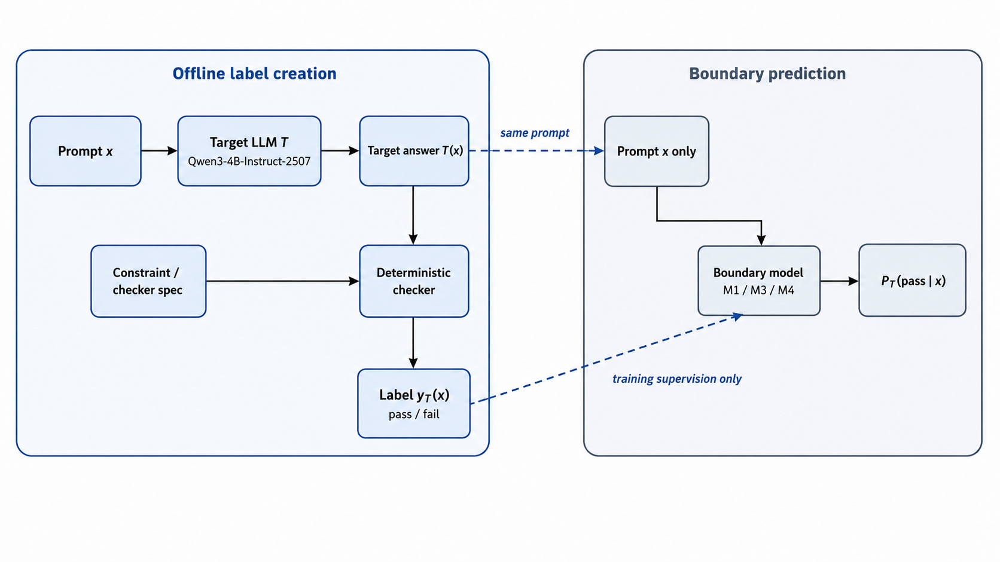

*阅读重点：目标回答只在打标签阶段使用。推理时，边界模型只接收 prompt，并输出通过检查器的概率分数。*

数据流程是：

```text
Prompt
  -> local target LLM
  -> target response
  -> deterministic checker
  -> pass/fail label
  -> small boundary model
  -> P(pass)
```

这让这个问题不同于模型蒸馏。我们不是训练一个更小的模型去回答 prompt，而是训练它去预测目标模型的一个行为边界。

## 数据切分

主 benchmark 使用 atomic constraint held-out split。部分 atomic instruction IDs 会从 train 和 validation 中完全移除，并只出现在 test 中。因此 test 集检验的是边界模型能否泛化到未见过的约束类型。

| Split | Train rows | Val rows | Test rows | Test positive rate | Baseline AUPRC | Held-out unit |
|---|---:|---:|---:|---:|---:|---|
| group-key split | 66,245 | 8,280 | 8,281 | 29.7% | 29.7% | `base_key` |
| atomic constraint held-out | 61,655 | 6,851 | 14,300 | 14.8% | 14.8% | `instruction_id` |
| composition C1 | 61,388 | 15,501 | 5,917 | 4.7% | 4.7% | `num_constraints` |
| composition C2 | 76,889 | 1,183 | 4,734 | 4.6% | 4.6% | `num_constraints` |

*阅读重点：headline split 是 atomic constraint held-out 这一行：61,655 train、6,851 validation、14,300 test，test 正例率为 14.8%。*

开发过程中我也跑了更容易的切分和替代切分。group-key split 通过按 `base_key` 分组防止原始任务泄漏。composition splits 则 hold out 更多同时出现的约束数量。这些都是有用的诊断，但下面的干净主结果只使用严格的 atomic held-out 协议。

## 协议卡

下面是 headline result 使用的协议简表。

| Item | Value |
|---|---|
| Target model | 本地 Qwen3-4B-Instruct-2507 部署 |
| Task family | IFEval 风格的可验证指令 |
| Label | `1[checker(T(x)) = pass]` |
| Boundary-model input at inference | 仅 prompt text |
| Main split | Atomic constraint held-out |
| Held-out unit | `instruction_id` |
| Main train / validation / test rows | 61,655 / 6,851 / 14,300 |
| Test positive rate | 14.8% |
| Random-ranker AUPRC baseline | 14.8% |
| Main tokenizer protocol | 只用 atomic-train prompts 训练 raw-prompt tokenizer |
| Model selection | validation-selected configs 与 test-oracle diagnostics 分开报告 |
| Error bars | 跨训练 seed 的 mean ± standard deviation |

关键细节是 held-out unit。test prompts 包含 train 和 validation 中都不存在的 atomic instruction IDs，所以主结果不是只在测量熟悉 atomic constraints 上的插值能力。

## 为什么用 AUPRC？

严格 atomic test set 存在类别不平衡：只有 14.8% 的样本通过 checker。一个大多数时候预测失败的模型，即使用普通 accuracy 看起来还可以，也可能并不擅长找到会通过的 prompts。AUPRC 更适合这项研究，因为实际问题是排序：如果我想找可能通过的 prompts，哪些应该排在最前面？

随机排序器的期望 AUPRC 等于正例率。在这个 split 中，它是 14.8%。因此，从 14.8% 提升到 36.6% 或 46.1% 不是一个小的表面收益；它意味着只看 prompt 的模型把更多真正会通过的样本排到了列表前部。

## 模型

我使用了三个模型族。

| Model | Description |
|---|---|
| M1 TF-IDF | Raw-prompt byte-BPE token n-gram TF-IDF 加 logistic regression |
| M3 mean | 小型监督式双向 Transformer encoder，mean pooling，MLP head |
| M4 frozen | IF-domain pretrained encoder 冻结后，加 target-specific MLP head |

M1 是词法基线：如果它有效，说明边界具有很强的表层规律。M3 是直接针对这个目标模型和 checker 训练的小型监督边界模型。M4 是表示迁移基线：encoder 先在 instruction-following 风格文本上预训练，然后冻结，只有一个小的目标特定 head 会适配这个 pass/fail 任务。

这个区别对解释结果很重要。如果 M4 获胜，主故事就是可复用的指令域表示。如果 M3 获胜，主故事就是一个小型监督模型可以直接学到这个特定目标模型的边界。在本次运行中，M4 明显有用，但没有超过 M3。

严格协议还会只用 atomic train prompts 重新训练 raw-prompt tokenizer。这避免了一个 caveat：在另一种 split 协议下训练的 tokenizer 可能已经见过 atomic held-out test prompts 的文本。

## 一个很强的基线

在神经模型之前，M1 已经能做有意义的边界预测。在不同 split 类型上，它都大幅超过正例率基线。

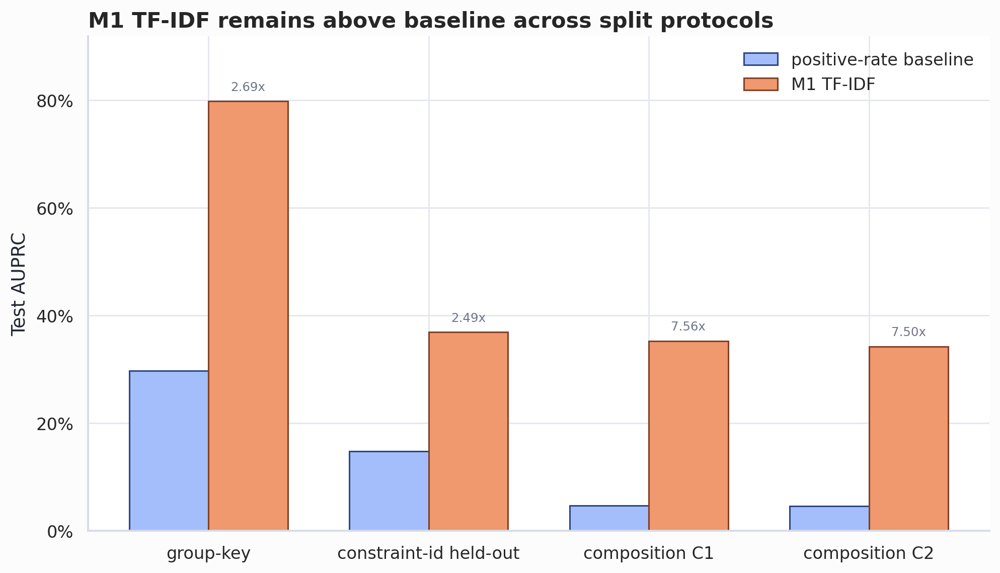

*阅读重点：和正例率基线的对比是关键参照；M1 已经在各个 split 上远高于随机排序。*

这很重要，因为 TF-IDF 便宜、稳定，而且很难击败。任何更大的边界模型都必须证明自己相对这个基线是值得的。

## 干净的主结果

主结果只使用严格的 atomic-train tokenizer。

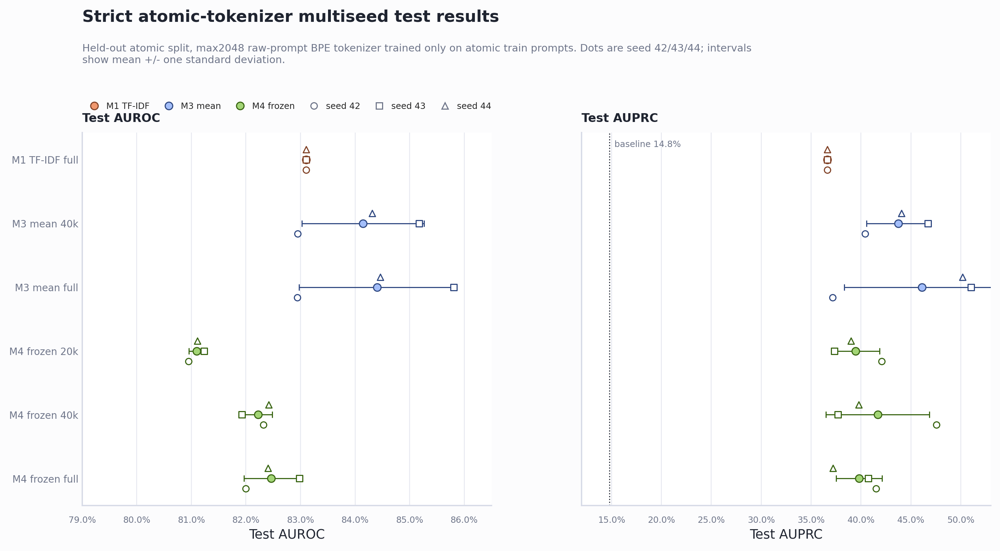

*阅读重点：主比较是是否有小型 prompt-only 模型能在严格 atomic OOD 下超过 14.8% 基线，而不只是哪个神经配置最高。*

关键 test AUPRC 数字是：

| Model/config | Test AUPRC |
|---|---:|
| Positive-rate baseline | 14.8% |
| M1 TF-IDF full | 36.6% |
| M3 mean 40k | 43.7% ± 3.2% |
| M3 mean full | 46.1% ± 7.8% |
| M4 frozen 40k | 41.7% ± 5.2% |
| M4 frozen full | 39.8% ± 2.3% |

M3 mean full 是这个严格协议下平均结果最好的配置，但它也对 seed 敏感。M3 mean 40k 略低一些，但更稳定。M4 相比 M1 有提升，但没有超过 M3。

我会把 M3 full 看作边界可压缩性的最强证据，把 M3 40k 看作更保守的神经模型参照点。两者共同支持同一个主结论：在严格 atomic OOD 下，一个很小的 prompt-only encoder 可以超过 TF-IDF 基线，但神经模型之间的精确排序仍然有噪声。

这个结果的启示不是“越大越好”。冻结的 IF-domain encoder 是有用的，但在这个设置里，更简单的监督式 M3 encoder 更强。一个合理解释是，冻结 encoder 提供了通用的指令表示，而 M3 可以把全部参数都适配到这里的具体 checker 边界和目标模型上。

## Tokenizer 协议审计

早期实验使用了旧的 group-key tokenizer。这个 tokenizer 是无监督的，但它是在另一种 split 协议下训练的。为了得到干净的 atomic held-out 故事，我只用 atomic train prompts 重新训练了 tokenizer，并重跑了关键模型。

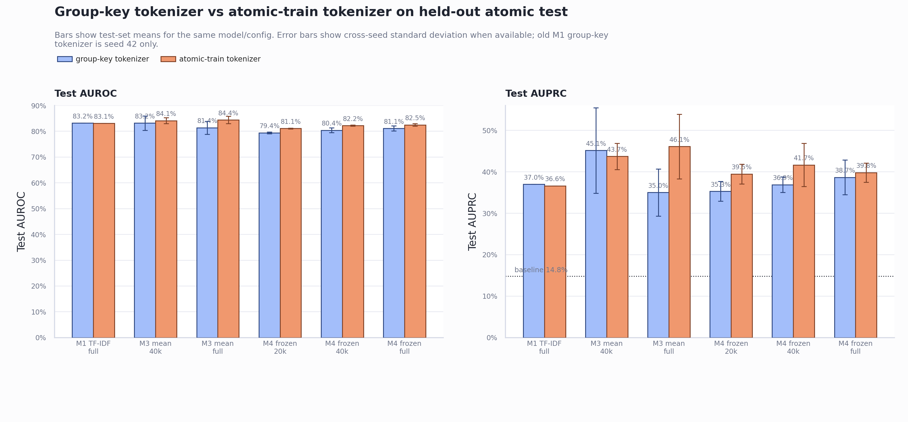

*阅读重点：更严格的 tokenizer 消除了一个可能的预处理 caveat，同时没有削弱主结论。*

严格 tokenizer 没有削弱结果。在几个配置上，它还提升了结果：

| Config | Old group-key tokenizer AUPRC | Strict atomic-train tokenizer AUPRC |
|---|---:|---:|
| M1 full | 37.0% | 36.6% |
| M3 40k | 45.1% | 43.7% |
| M3 full | 35.0% | 46.1% |
| M4 20k | 35.3% | 39.5% |
| M4 40k | 36.9% | 41.7% |
| M4 full | 38.7% | 39.8% |

tokenizer 诊断不支持“长度或 token 支持造成 artifact”的解释。两个 tokenizer 的 prompt 长度几乎相同，p95 长度都是 577 tokens，truncation 约为 0.24%。

| Tokenizer protocol | Vocab size | Fit prompt count | Fit split | Rows | Mean token length | p95 token length | Max token length | Truncation rate | Unseen test token IDs | Unseen token mass |
|---|---:|---:|---|---:|---:|---:|---:|---:|---:|---:|
| old group-key | 8,000 | - | group-key train | 82,806 | 227.9 | 577 | 5,786 | 0.243% | 3 | 1.78e-6 |
| strict atomic-train | 8,000 | 61,655 | atomic train | 82,806 | 228.0 | 577 | 5,527 | 0.242% | 3 | 1.77e-6 |

*阅读重点：prompt 长度和 truncation rate 几乎没有变化，因此 tokenizer 结果不太可能是长度支持 artifact。*

所以，干净的严格协议并不是一个更严格但更弱的版本。它是支撑主张时更合适的协议。

## Validation 选择 vs Test Oracle

由于这项研究包含迭代式开发，我想做一个简单的 anti-cherry-picking 检查：如果只看 validation，会选择什么？如果看 test oracle，最优结果又是什么？

| Model family | Selection rule | Selected config | Val AUPRC | Test AUROC | Test AUPRC | Test Brier | Test ECE |
|---|---|---|---:|---:|---:|---:|---:|
| M1 TF-IDF | validation-selected by val AUPRC | baseline full | 80.0% | 83.1% | 36.6% | 16.4% | 20.5% |
| M1 TF-IDF | oracle-best by test AUPRC | baseline full | 80.0% | 83.1% | 36.6% | 16.4% | 20.5% |
| M3 mean | validation-selected by val AUPRC | mean pooling full | 80.7% | 84.4% | 46.1% | 16.0% | 14.5% |
| M3 mean | oracle-best by test AUPRC | mean pooling full | 80.7% | 84.4% | 46.1% | 16.0% | 14.5% |
| M4 frozen | validation-selected by val AUPRC | frozen encoder full | 79.2% | 82.5% | 39.8% | 16.7% | 16.5% |
| M4 frozen | oracle-best by test AUPRC | frozen encoder 40k | 77.6% | 82.2% | 41.7% | 16.0% | 15.2% |

*阅读重点：validation selection 和 test-oracle selection 对 M3 基本一致；M4 则说明为什么 oracle-best 数字应该只被当作诊断。*

对 M1 来说，严格协议下只有一个配置。对 M3 来说，validation selection 和 test oracle 都选择 full。对 M4 来说，validation 选择 full，而 test oracle 选择 40k。这就是为什么我把 M4 40k 当作有趣的诊断点，而不是干净的 validation-selected winner。

calibration 指标在这里也有用。M3 full 的 ECE 低于 M1，但这些模型都还没有达到开箱即用的良好校准。

## 严格关键点学习曲线

严格 tokenizer 运行不是完整 learning curve。它只包含最终比较所需的关键点。即便如此，这条稀疏趋势仍然有信息量。

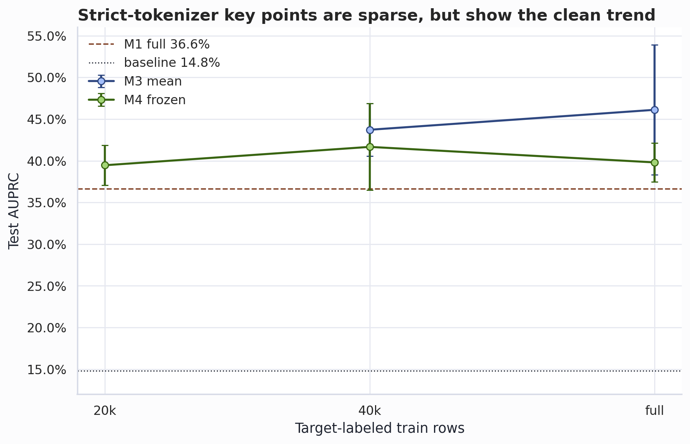

*阅读重点：这是一条稀疏关键点曲线，不是完整 scaling law；它主要用于检查严格 tokenizer 结果不是孤立点。*

M3 从 40k 到 full 平均有收益。M4 从 20k 到 40k 有提升，但 full 没有继续提高 test AUPRC。这和更广泛的开发过程一致：validation performance 可以继续提高，而 atomic held-out test ranking 不一定随之提高。

## Selective Prediction

即使边界模型在 100% coverage 下并不完美，它仍然有用。一个自然用途是 high-confidence filtering：只处理模型最有信心的 prompts。

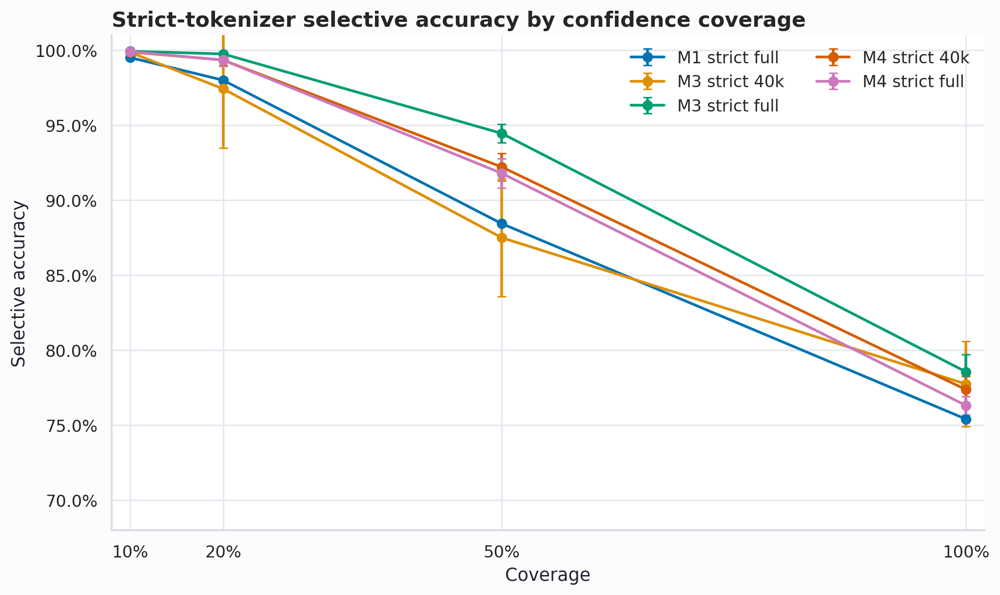

*阅读重点：selective accuracy 显示分数可用于过滤，但它可能被占多数的负类抬高。*

在 50% coverage 下，M3 full 达到约 94.5% selective accuracy，而 full coverage 下约为 78.6%。M4 40k 在 50% coverage 下约为 92.2%。

selective accuracy 可能被负类主导，因此我也测量了 top predicted-pass prompts 中的 precision。

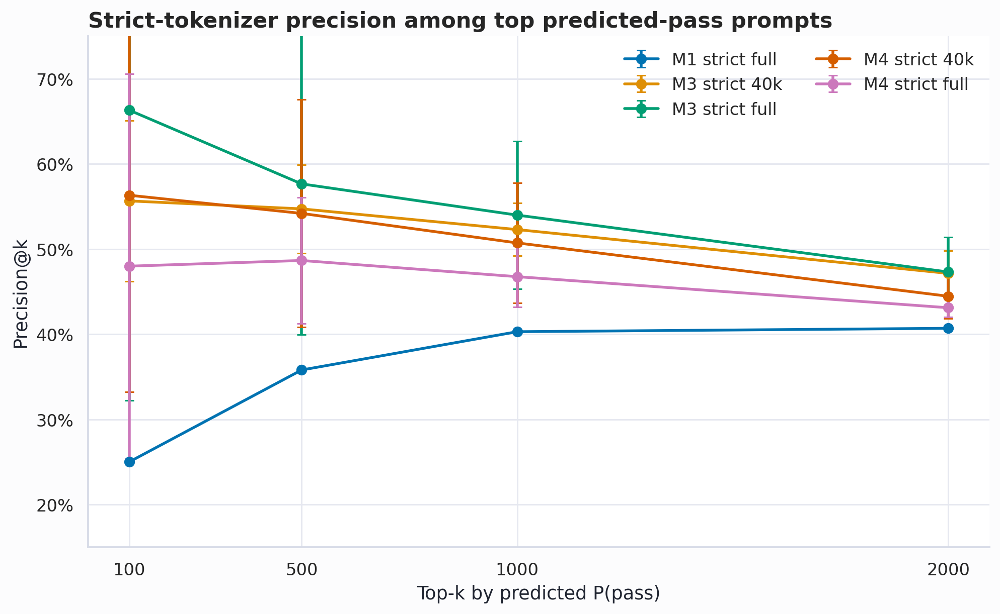

*阅读重点：当操作目标是找到可能通过的 prompts 时，Top-k precision 是更直接的指标。*

如果目标是找到可能通过的 prompts，Top-k precision 是更重要的操作指标。在 top-100 上，M3 full 平均 precision 为 66.3%，M3 40k 为 55.7%，M4 40k 为 56.3%，M1 为 25.0%。小 k 下方差较高，但神经模型显然比 M1 更擅长把可能通过的 prompts 排到前面。

## 校准

这些模型能排序出有用信号，但概率没有良好校准。

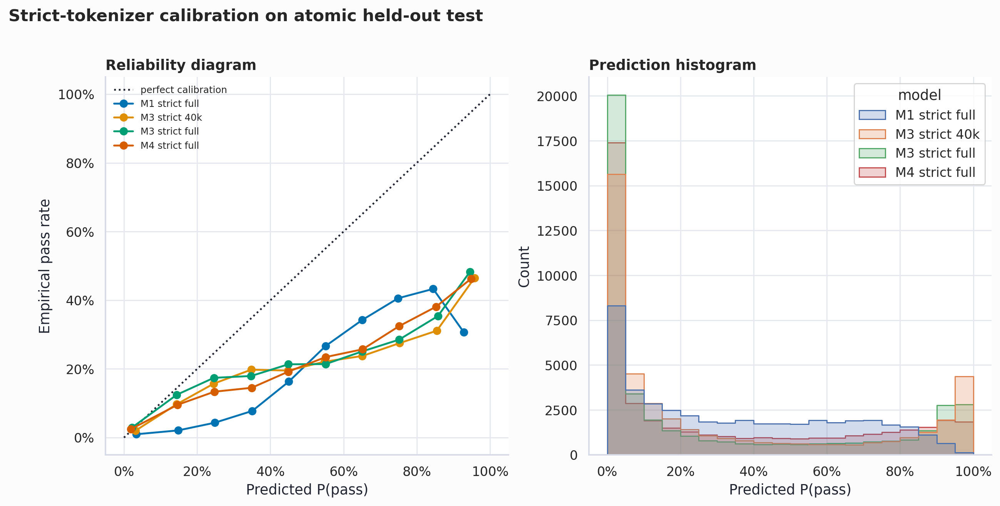

*阅读重点：分数可用于 prompt 排序，但 reliability curves 提醒我们不要把它们当作字面概率。*

所有模型在高预测概率区域都过度自信。reliability curves 在大多数 bins 中位于对角线下方。这意味着这些分数适合用于排序和选择，但不应在没有 post-hoc calibration 的情况下解释为已校准概率。

test 上的 ECE 值是：

| Model/config | Test ECE |
|---|---:|
| M1 full | 20.5% |
| M3 full | 14.5% |
| M4 40k | 15.2% |
| M4 full | 16.5% |

M3 full 在这些模型中最好，但 14.5% ECE 仍然很高。

## M1 学到了什么

M1 模型足够简单，可以直接检查。它最强的 token n-grams 映射到普通 prompt 片段，例如 punctuation、"appear at least"、"keyword"、"word"、"in your response" 和 "each sentence"。

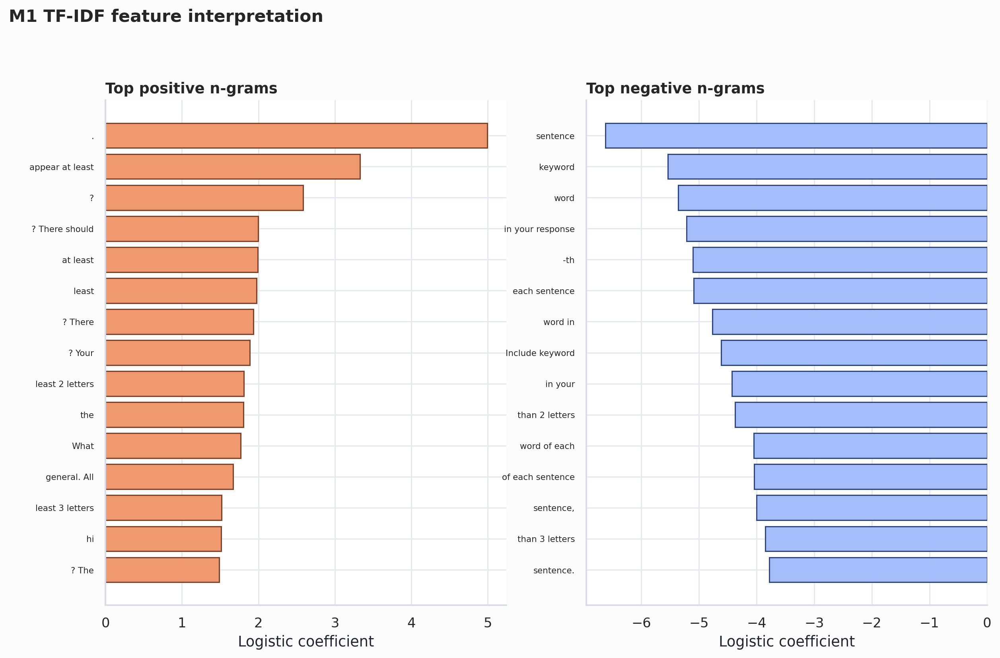

*阅读重点：最强特征是普通 prompt 片段，这支持一种解释：许多失败和表层 prompt 线索相关。*

这是一个有用的 sanity check。基线并不神奇。它抓住的是约束措辞和格式要求中的规律。这也解释了为什么它很强：许多 checker failures 都绑定在 prompt 中明确可见的表层约束上。

## 哪些约束更难？

atomic held-out test 并不均匀。有些约束比其他约束更容易排序。

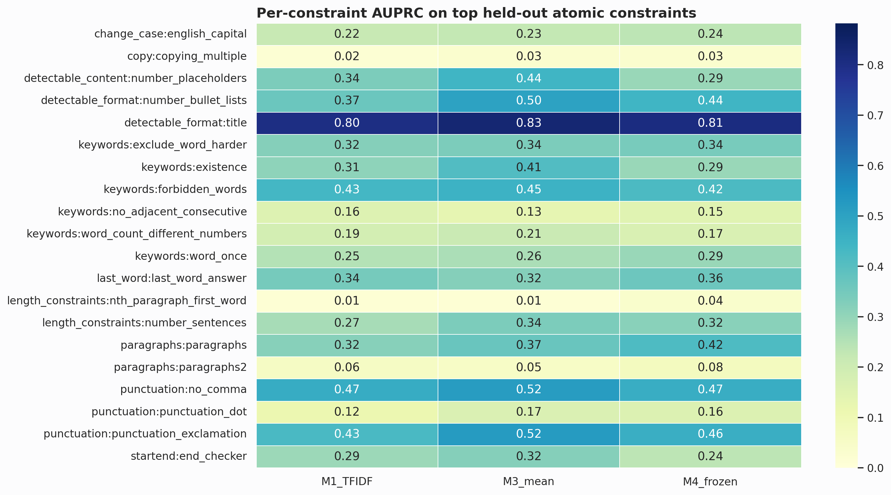

*阅读重点：平均来看边界是可压缩的，但不同约束族的难度差异很大。*

`detectable_format:title` 相对容易：所有模型表现都强，M3 最好。一些约束则困难得多，例如 `copy:copying_multiple` 和 `length_constraints:nth_paragraph_first_word`。对几个关键词和标点约束，M3 或 M4 相比 M1 有提升，但最佳模型会随约束变化。

这支持一种更谨慎的解释：边界是可压缩的，但不是均匀可压缩。困难案例是真实存在的。

## 错误分析

当前 artifact 不包含人工审计过的 prompt-level error table，因此我不想在这里编造单个样例。不过，聚合结果指向了几个具体的错误模式。

| Mode | Evidence in this run | Interpretation |
|---|---|---|
| Easy surface-format regions | M1 feature coefficients and strong `detectable_format:title` AUPRC | 一些 checker outcomes 与可见 prompt 片段强相关，例如 title、keyword、punctuation 和 sentence-form constraints。 |
| False-positive risk | Keyword and punctuation fragments can look easy to a prompt-only model | prompt 可能包含熟悉的 pass-associated wording，但目标模型仍然可能漏掉精确数量、必需 token 或格式细节。 |
| False-negative risk | Rare held-out atomic constraints have little direct training support | 即使目标模型碰巧能遵守，边界模型也可能因为约束措辞陌生而把它排得过低。 |
| Genuine hard cases | `copy:copying_multiple` and `length_constraints:nth_paragraph_first_word` remain difficult | 这些任务需要比简单表层线索更结构化的回答行为。 |

对于更完整的公开 benchmark，下一步应该从 `predictions.parquet` 中加入一个真实 prompt-level cases 小表：高置信 true positives、false positives、false negatives，以及几个困难约束的具体样例。这样可以让聚合故事更可检查，同时不改变 headline metric。

## 探索性结果

旧 tokenizer 实验有助于理解研究路径，但我不会把它们当作干净 benchmark。

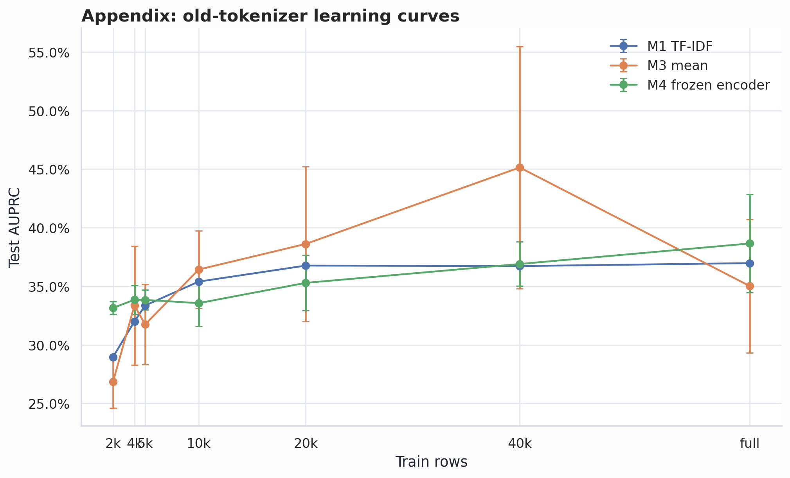

*阅读重点：这些旧运行有助于理解研究过程，但它们不是干净 benchmark。*

在旧 tokenizer 下，M3 在 atomic held-out test 上大约在 40k 达到峰值，之后 full 反而下降。这推动了后续的 seed sensitivity 和 validation/test mismatch 分析。

我也在旧 tokenizer 协议下尝试了 CLS pooling 和更大的 M3 capacity variants。

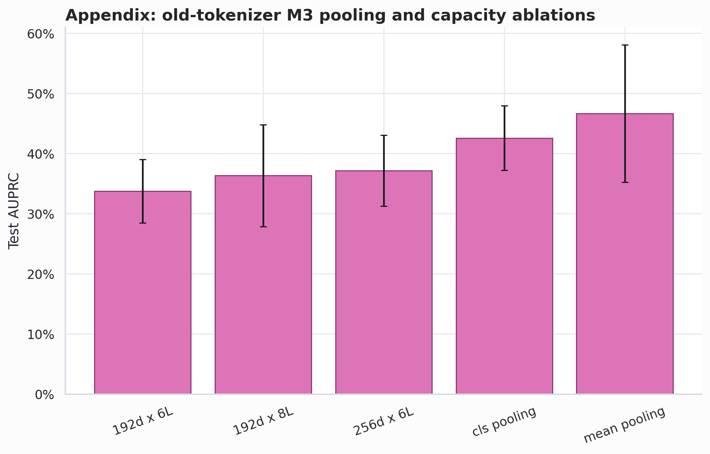

*阅读重点：更大或替代的 M3 变体没有给出足够稳定的收益，因此不改变 model-family story。*

capacity variants 没有产生足够稳定的收益，不足以支撑继续扩大规模。

fixed-sample 55k 实验显示了明显的 training-seed sensitivity。

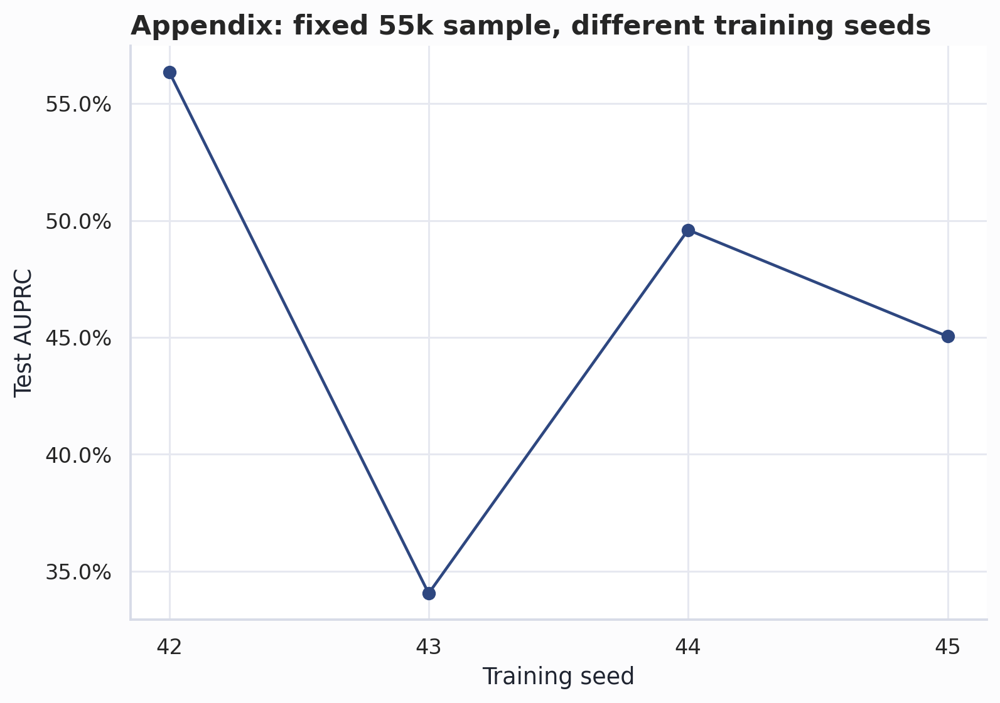

*阅读重点：seed spread 提醒我们，神经模型排名应该按方差解释，而不是当作单个确定数字。*

这也是我停止继续扩展模型族、转而聚焦协议清理的原因之一。到这个阶段，主要不确定性已经不再是是否还能尝试更大的模型族，而是协议是否足够干净，以及观察到的边界信号能否在更严格的预处理和选择规则下保持稳健。

## Dataset and IFEval attribution

本研究使用 IFEval 风格的可验证指令跟随任务。IFEval 由 Zhou et al. 提出，是一个客观且可复现的指令跟随 benchmark，基于长度、关键词、格式、标点等可自动检查的约束。

本文不报告标准 IFEval benchmark 分数。相反，它使用 IFEval 风格的 checker setting 来定义一个不同的监督问题：只给定 prompt `x`，预测固定本地目标模型 `T` 是否会生成一个能通过确定性 checker 的回答。

在适用处，prompt 格式、constraint families 和 checker logic 来自或受原始 IFEval code 和 data 启发。本实验中的修改包括：用 Qwen3-4B-Instruct-2507 进行 target-model relabeling，为 boundary prediction 构造 split，以及训练 prompt-only 的监督边界模型。

## References

- Zhou, J., Lu, T., Mishra, S., Brahma, S., Basu, S., Luan, Y., Zhou, D., & Hou, L. (2023). Instruction-Following Evaluation for Large Language Models. arXiv:2311.07911.
- Google Research IFEval implementation and data: `google-research/google-research/instruction_following_eval`.

原始 IFEval 数据以 CC BY 4.0 发布，源代码由 Google Research 以 Apache 2.0 发布。本文仅将它作为 instruction/checker source，用于构造特定目标模型的边界标签。

## 局限性

这是一项探索性研究，不是排行榜。

重要局限包括：

- 只使用了一个目标模型。
- 只使用了一个任务族：可验证的 instruction-following prompts。
- atomic held-out test set 在模型开发过程中被查看过。
- 标签依赖确定性 checker，而不是人类偏好。
- 边界模型预测的是 checker pass/fail，不是目标回答是否整体有用。
- 高 AUPRC 不意味着模型“理解”了指令。它可能学到的是与目标模型失败相关的 prompt 表层规律。
- 概率还没有校准到可以直接当作字面概率使用。

第三点是最重要的协议 caveat。因为 atomic held-out test set 影响过开发决策，我把这个结果视为边界可压缩性的证据，而不是最终 benchmark 数字。更强的后续工作应该提前冻结协议，加入一个新的未触碰 held-out split，并至少在另一个目标模型上重复评估。

## Takeaways

1. 低耦合的 LLM 行为边界可以高度可压缩。
2. TF-IDF logistic regression 是一个出乎意料地强的基线。
3. 小型监督 encoder 在严格 atomic OOD 下提升了 AUPRC。
4. 冻结的 IF-domain pretraining 不会自动更好。
5. split-specific preprocessing 和 tokenization 很重要。
6. 在当前模型中，排序比校准更可靠。

最站得住脚的 headline result 是：

```text
Positive-rate baseline AUPRC: 14.8%
M1 strict TF-IDF full AUPRC: 36.6%
M3 strict mean full AUPRC: 46.1% ± 7.8%
M3 strict mean 40k AUPRC: 43.7% ± 3.2%
M4 strict frozen 40k AUPRC: 41.7% ± 5.2%
```

这足以支持核心主张：对于这类可验证指令，目标模型的 pass/fail 边界远小于目标模型本身。

## 可复现性说明

最终博客资产位于：

```text
boundary-if/runs/blog_final_assets/
```

核心文件：

```text
run_metrics.csv
run_metrics_by_config.csv
selection_table.csv
predictions.parquet
selective_metrics.csv
topk_metrics.csv
calibration_bins.csv
per_constraint_metrics.csv
tokenizer_audit.csv
feature_coefficients.csv
```

生成脚本是：

```text
boundary-if/scripts/generate_blog_final_assets.py
```

如果要在我的环境之外正式复现发布，我还会固定目标模型 decoding configuration、maximum output length、checker version 或 commit hash、random seeds、optimizer settings、learning rate、batch size、epoch schedule、M3/M4 architecture details，以及生成 labels 和训练每个 boundary model 的精确命令行。

这份 Markdown 使用本地相对路径引用图片。发布时我会把图表作为单独的 PNG 或 WebP 文件导出，并通过 path 或 CDN URL 引用。这样文章更小，也更容易 review diff。
